

    <h1>社会人格，社会人格学的基础</h1>

> 原作者：Аушра Аугустинавичюте  
翻译源：https://classicsocionics.wordpress.com/socion/  
译者：早霜真琴  

### 缩写简表
IM：信息代谢(Information Metabolism)  
EM: 能量代谢(Energy Metabolism)  
IME: 信息代谢元素(IM Elements)  
TIM: 信息代谢类型，即socionics类型(Type of IM)

## 前言
社会人格学是一门研究社会人格（Socion）、人的社会人格本质，以及从社会人格的角度研究社会结构的学科，它研究的是不同类型的人的信息代谢（Information Metabolism, **IM**）和不同形式的类间关系。它的诞生的基础，是荣格（C.G, Jung）、E.克雷奇默（E.  Kretschmer）和A.E.利奇科（A.E. Lichko）创造的类型学，以及A.凯平斯基（A.Kepinski）的信息代谢理论。它是一门精确的科学，表明物理学规律*是人类的感知和思维，以及的社会运作和发展的基础。

（* 作者注：作为一个人文学者，作者所说的“物理学”一词是指所有基于严格的因果逻辑，即亚里士多德逻辑运作的学科。）  

本专著介绍了社会人格学的基本前提、主要类别和定义。这项工作仍未完成。它仍然包含很多不准确和自相矛盾的地方——由于这个主题的新颖性和作者专业素养的缺乏，我们不得不摸索着进行。显然，在这里，作者没有心理学或物理学学位这件事，并没有阻止我们看到超越荣格的心理类型*的新视野，然而它却严重阻碍了我们对所见事物进行描述和分类的尝试。由于这个原因，我们有时不得不使用日常化的用语，而不是心理学和物理学的既定术语。最严重的困难是，由于这个主题的新颖性，新的概念和定义必须引入。  

（\*英语译者注：参见荣格的《心理类型》第十章。）  

读者可能会认为，我们的一些规定是纯粹的理论建构，没有充分的理论证明，仿佛是无根之木、空中楼阁。例如，为什么世界上的信息元素正好有八个方面？为什么它们被组合成区块？为什么是这个区块而不是那个？等等。因此，我们有义务告诉读者，这里没有凭空编造的、全新的东西，我们只是深化和澄清了荣格阐明的概念，尽管其中一些已经变化得面目全非。我们是在研究各种人的具体思维方式时做到这一点的。在此过程中，我们首先验证了荣格所指出的感知世界、适应世界的16种方式确实存在。之后，在研究每一个IM类型理解世界、对现实的具体事实作出反应的方式时，我们破译了所有所谓“主导功能”（荣格）的具体内涵。我们大致阐明了每一种功能的具体内涵，以及它所反映的世界的信息-能量要素的不同侧面（我们并不确保这种理解是完整的）。在研究具有不同IM类型的个人在对他们来说重要或不重要的情况下的运作方式时，我们设法找到信息代谢元素之间的联系，然后是区块，等等。 

换句话说，虽然这项工作看起来是纯理论研究，但对于我们在对具体个人的实际观察中能够破译的一切，“理论”只是一种最密集地予以描述的方式。所谓的“纯理论”中的每一部分，无不产自我们的观察。如果有人有不同的印象，那只能怪作者自己的思维方式（**Ne**，**Ti**），以及她没有能力描述生活中社会人格的具体表现：虽然作者观察到了具体的事实，但当描述它们的时候，能写下来的只有一般的范式。  

## 1、引言：社会与社会人格
作为外部世界和内心世界的反映主体，一个人的大脑的服务对象不只是这个人本身，还有社会。  

为了满足自身的需要，一个人需要了解环境的全部。人们在提供社会价值的过程中进行合作：一个人向社会输出的信息只包含现实世界的一些侧面，而另一些侧面则未被传达。在我们目前的理解中，这一现象的解释较为简单：现实的各个侧面在人脑中分别反映，其分化和自觉意识的程度有所不同。那些只为个人自己使用的侧面的反映是抽象而概括的——它们被存储为视觉信息、经验和技能。另一方面，那些个人向社会输出的现实侧面以分化程度更高的方式存储，具有足以进行语言交流的分化程度。  

在那些只用于个人自身需要、停留在第一信号系统（系统一）\*层级的信息中，有一些可能在一定程度上可以在社会中他人的帮助下被个人所理解。个人向外界输出的信息，在个人的有意识理解过程中，进入第二信号系统（系统二）的层级；具体的信息根据随IM类型的不同而不同。  

（\*中文译者注：第一信号系统、第二信号系统、系统一、系统二：这里指的是关于人脑中存在两个信号系统的理论：系统一是反应迅速的、第一感觉的系统；系统二是反应较慢的、深度思考的系统。） 

每个人和其他人都作为社会的部分，在提供社会价值的过程中进行合作，因此每个人都输出关于现实的某些侧面的信息，并接收关于其他方面的信息。稍后我们将深入讨论这个问题，在此之前我们将用一个例子来展示上述过程。一件令我们惊讶的事情是，那些整天心不在焉、“从不记得任何事情”、也“从不看到任何东西”的人，并不会因此伤到自己，也不会被他们遇到的每一辆车撞倒。这是因为，他们收到的关于周围的实在物体的信息只够自己使用，但不足以言语化输出。这就是这些人看起来心不在焉的原因。他们对现实的较为抽象的侧面的信息的感知更加深刻而清醒，可以更加轻松地输出。同理，另一些人深度感知关于具体实在的信息，而现实的那些被称为“抽象现实”的侧面似乎被忽略了，尽管这些人完全有能力利用它们来满足自己的需要。前者通常被称为抽象思维者（直觉型），后者则被称为具象思维者（感觉型）。值得注意的是，前者（直觉型）的思维更加迟钝一些：直觉型需要更多的信息来理清思路，这就是为什么他们经常表现得心不在焉、头脑迟钝。相反，感觉型能够立即给人留下深刻印象，因为他们能够迅速产生对形势的理解。前者擅长「战略」，后者擅长「战术」\*。这两种品质在任何情况下都有同等的价值，同样为任何社会所需要。 

（\*中文译者注：请不要将这里的战术和战略与“雷宁二分”中的“战术/战略”二分相混淆。雷宁二分中的战术/战略指的是更大时间尺度上的行为倾向。）  

一般的生物作为独立的单元，只为生育的目的与自己的同类合作。而作为社会单元的人则不具备这种独立性。    

这种不独立性来源于人和人在心理层面上处理信息的方式的不同。这样的方式有十六种，每个人只能充分掌握其中的一种。十六种信息处理方式构成了一个统一的系统。由于这个系统，人能够成为社会意义上的人，“文化”的构建也才成为可能。如果只存在一种的信息处理方式、一个信息代谢类型，是难以有所产出的。即使一个团体中存在非常多相同IM类型的人，这个团体的能量-信息交互效率依旧是低下的，甚至无法解决最简单的生活问题。人类的长处在于其智慧的多样性，即十六IM类型的存在。  

由此可见，一个人的智慧是整个社会智慧的十六分之一。为了简化研究，我们可以将十六个这样的“十六分之一”组成一个完整的单元。这个单元由16个具有不同IM类型的人组成*，我们称之为社会人格（The Socion）。社会人格可视为人类社会的基本单位，是人类的社会性的基础。  

（\*中文译者注：译者倾向于认为，The Socion由十六个TIM的模型，而不是拥有十六个TIM的一组人组成。）  

但“社会人格”不仅仅是16种不同智慧（IM类型）的简单相加，也不仅仅是16个具有不同IM类型的人组成的团体。这个严格定义的体系也包含十六种IM类型之间的互动关系。换句话说，社会人格不仅是十六种具体的智慧形式（IM类型）本身，也包括每个人与其他人之间的十六种具体的互动关系。这些关系将这些人组合为一个统一的逻辑整体——从某种意义上说，社会人格是人类的一个能量单位。图1展现了这个能量单位的一种运作模式。  

首先，为了协调这些个体的生命活动线，十六种IM类型形成八组“对偶对”。据我们所知，人类智慧的完整具现离不开这个过程。其次，八对对偶被分为两个能量环，一个环由四个对偶对组成，环内以单向信息-能量线连接，新的信息只沿着一个方向流动。第三，内外两个环中的信息流方向相反。两环以“感应”的方式相连接：一环的信息流“激活”了另一环，为其注入能量。在图1中，每个小圆圈代表一种IM类型，箭头显示了信息流的方向。  

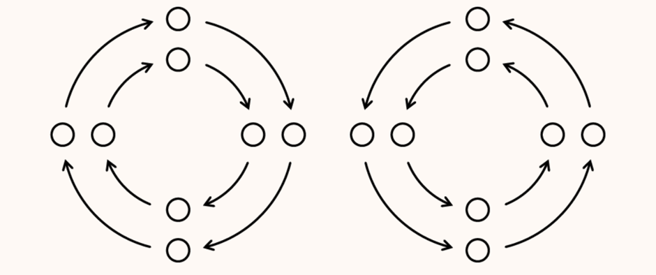  

图1 社会环

这样一个泛化的结构图只展示了每对对偶IM类型（Type of IM，TIM）之间的互补关系，以及由箭头连接的、对偶对之间的社会请求*关系。但事实上，社会人格的每一部分，都与社会人格的任意其他部分有着特定的关系。换句话说，每一种TIM都与其他TIM有着特定的关系，即类间关系。从一个TIM的视角上看，类间关系总共有十六种。

（*英语译者注：以下“社会请求”是通常被称为“有益关系”的类间关系。“请求者”是指施益方，而“接收者”是指受益方。）

因此，作为人类社会的基本单元，社会人格不仅是人类智慧的十六种类型或形式，也是它们之间的关系的十六种形式，这些关系把人类结合为一个有逻辑功能的整体。社会发展的所有规律，包括社会进步的规律，都是作为社会单元的社会人格所固有的。  

每个人的发展都基于一个TIM，即每个人都获得了十六种可能的智慧形式中的一种。人的社会人格学本质（the socionic nature of man）体现为以下方面：

1.	人与人感知世界的方式有所差异。  
2.	决定一个人与其他的关系是好是坏、相处是容易还是困难的因素，不是他人的善意和恶意，而是社会人格中他人的TIM与这人的TIM的互动关系。    

每个有机体的生存机会，决定于其适应环境的能力，即有机体自身与环境，以及环境中其他有机体保持和谐关系的能力。但是，人类不只是有机体，也是积极的、社会的人，与环境保持和谐并不是人们生存的唯一需要，人们还需要融入外部社会的IM机制中。社会的进步程度与上述社会的“社会人格性”（socionness）成正比。  

对于任何人而言，不在对偶对之中，即缺乏可以一同协作的对偶，是非常痛苦的。这扰乱了人的心理和生理的平衡。这并不是说，个人无法“感知到”自己参与了社会中社会人格机制（socionic mechanism）的运作。有的人积极投入社会生活，感知到社会对他们积极性的需要；也有的人几乎或完全不觉得自己被社会需要，尽管他们从报纸上知道这点。仅仅“知道”被需要是不够的——人需要“感受”到生活的脉动，切身感受到自己是脉动的社会生活的一部分。为此，为了保持必要的社会功能的运作，一个人需要与若干必要的TIM接触（下文称“必要TIM”或“必要类型”）。“被社会需要”的感觉，或许与个人融入上述社会人格结构（socionic structure）的程度成正比。  

在社会人格之外进行的交互活动，或社会人格内的互动占比较少的社会交互活动，一定使人极度心理疲劳。个人的能量消耗严重，且难以得到补充。更糟糕的是，这些能量白白消耗，产生不了多少社会价值。大量的能量只是被浪费在证明“自己的生命对自己和他人有用”这件事上。从社会的角度，这是一种能量的浪费；从个人的角度，这是为了寻找可以“感到被需要”的一席之地而进行的斗争。人们竞争，是为了一个能量-信息运转更高效的社会地位，这个地位所带来的社交扩展，为人提供了与必要TIM的联系，这样，这人会感知到一种更高层次的认可。处于领导地位的人，与拥有必要TIM的人有更多的联系；只有这些联系才能使人产生“被纳入社会生活”和“被社会需要”的感觉。不过，如果一个人身边已经存在了这些必要TIM的持有者，那么无论他们身处什么地位或职业，都会在工作场所感到被需要。  

社会人格之外的交互活动的实用性很低。社会不需要这样的活动，因此这些活动不受社会欢迎。一个社会进步的速度正比于这个社会的“社会人格性”。

如果“社会人格性”是自发形成的，那么这个群体的大量精力就会被消耗在无休止的类间冲突中。从这个角度上看，私营企业比计划经济国家的优势正是在于，企业主有机会只雇用他们相处愉快的人，这样，他们就不会被卷入难以接受的、降低效率的类间关系冲突中去。

我们认为，人类社会的诞生伴随着社会人格和人类语言的诞生，也就是说，当人类的心理分化为十六种TIM、第二信号系统出现时，人类社会就诞生了。这是因为，对于动物来说，第一信号系统就足够使用了，因为它们对客观世界的理解是同质的。人类的理解则不具备这种同质性。作为一个物种，智人的代表不是单独的人，而是一对夫妻。人类作为整体，包含了个人和环境之间十六种不同的信息交换模式，并以社会人格为特征。要了解人类，就需要了解八对对偶，或者全部十六种TIM。

第二信号系统有助于人们交流，但也制造了误解的空间，因为即使是同样的话语，被不同的TIM所表达，就意味着不同的事情。举个例子：四个人都说了“不”字，语调和情境完全一致。第一个人的“不”意味着不可撤销的决定；第二个人说“不”，是因为他们认为在这种情况下，说别的话是不礼貌的；第三个人则在探查对话者的意图；至于第四个人，如果在他说“不”之后没有人和他争论，就会感到被冒犯。这个现象和IM类型有关！更不用说，社会地位、教养、气质等TIM外因素也造成了一定的差异。

在社会人格诞生之前，人类不需要语言，因为第一信号系统就足够生存需要了。当社会人格诞生的时候，语言就成为了一种必需。

在社会人格诞生前，人类是什么样的？为了回答这个问题，我们将从IM理论的角度检视灵长类动物的心理。猴子有多少种类型？首先，它们可以被分为理性型（cyclothyme）和非理性型（schizothyme）\*。外向和内向也许是另一个可行的二分。时至今日\**，我们仍旧对此知之甚少。一些列宁格勒（圣彼得堡）的学者研究了猴子之间的合作，并认为它们也有可能基于单向信息传递，构建不对称的关系，产生一方对另一方的“权威”。

（\* 英文译者注：参见《体质与性格》（Psysique and Character），E·克雷齐默尔著）

（\** 中文译者注：自本文的撰写以来，有关领域有了突破性的进展。译者没有检查这个领域的研究进展，如有读者知晓，可以联系译者。）

当第二信号系统出现时，能量代谢（Energy Metabolism，EM）和信息代谢（Information Metabolism，IM）之间的部分分离随之产生。借由系统二，信息有可能从能量代谢过程中完全分离出来。因此，在社会交互中，一个人不再只需要注意其他人的行为，也应该注意到他们的话语。

行为本身是不可信的，因为人会为了欺骗而改变行为。但是，可以在第二信息系统中隐藏的欺骗远比系统一多。此外，“虚假”信息不只有一种，而是有两种：

1.	故意编造的谎言，我们将不考虑这种。
2.	误解了他人的话语和想法，为它赋予了它不具备的意义或重量。

对于完全相同的话语、同样的语调，不同的人会产生不同的解读。我们的主要目标之一，就是研究这个现象，以及它背后的IM机理。
这项研究的对象是社会人格——人类社会的社会人格结构（the socionic structure of society）、人的社会人格本质（the socionic nature of man），不同IM类型及其类间关系。因此，我们称这项研究为**社会人格学（Socionics**）。

## 2、信息代谢元素，IME
**——个人和世界的对立与反映**

世界中的实体\*，有的有生命，有的无生命。前者比后者更复杂。此外，我们认为生命体是封闭的系统，生命体自身与外界间存在边界。某种意义上，每个生命体都复制了世界的属性。通过身体和心理机能，生命体完整地反映了整个世界。生命体将自己与外界分开，而无生命体则与外界融为一体。

（\* 中文译者注：这里的原文是object。译者不知道俄语原文如何表达，但是英语中object一词“物体”、“物品”、“客体”、“实体”（包括主体）四个含义混用。在下文中，译者将会将object翻译为不同的汉语词汇，请注意区分）

实体间直接交互（碰撞）并不经常发生。空间的“灾难”非常罕见，因为实体通过“场”进行远距离互动。生物体也通过场进行互动。从观察者的视角来看，一个生物体的场是它和其他实体之间关系的总和。这种相互作用在人的心智中产生了各种感受。

根据我们的观察，有机体从其环境中接收的信息有两类：

1.	感知（perception），提供关于实体属性和状态的信息。
2.	感受（feeling），提供关于场的信息。

人类心理接收的信息有两个界定要素，它们决定了上述信息的多寡和优劣。第一个因素是环境，它为人提供刺激信号。第二个因素是信息输入系统的强度、发展和训练。一个视力、听力敏锐，嗅觉高度发达的人可以从环境中获取更多信息。同样的环境会给“感受”高度精炼的人提供更完整的信息，提高他们的创造力，使他们成为作家、作曲家或科学家。
尽管人们知道物理世界一切实体具有场，但是“场”对于生物的重要性却没有得到同等承认，仿佛生物体不遵守同样的规律，是“物理学之外”的。人们没有注意到人类的感受（心理学的研究对象）是场的表现。人们也没有注意到，占人类一半的所有内倾者都关注他们的感受，以及他们对客体的态度，而不是客体本身。

对人类感情的机理的了解的缺乏，导致感受和情绪不断混为一谈，后者只是内分泌系统唤醒或抑制的一种表现，而前者则是一种感知。

（中文译者注：由于中文的词义混乱，译者将统一用语：feeling对应“感受”，emotion、mood对应“情感、情绪”。感情、情感和情绪不作区分，感受和这三者严格区分。）

### 反映的八个侧面
研究表明，人类对世界的感知可以被分为八个方面，其中四个方面对应实体的状态、四个方面对应场的状态。在人类心理中，它们彼此之间有清晰的界限，它们在人的意识还是潜意识、意识的层级，也因人而异。人和人以不同的方式处理八个方面。此外，对每个人来说，感知的一个方面处于主导地位，履行“主导功能”（荣格使用的术语）的作用。对于外倾的人来说，这个方面是对客体的感知；对于内倾的人来说，则是对场的感知。

我们为人对世界的反映的八个方面进行命名，并赋予了符号*。尽管我们沿用了荣格的概念，一些命名仍然需要修改以适配社会人格学的研究对象。

（中文译者注：Aushra原文使用的是她自己发明的八IME符号，但是译者决定将其改为二字母描述。本文中除了摘自原文的图片，将不使用Aushra的信息元素符号。）

八个信息元素的命名：  
|||
|---|---|
|**Ne** |	外倾直觉（Extraverted Intuition）|  
|**Ni** |	内倾直觉（Introverted Intuition）|  
|**Fe** |   外倾伦理（Extraverted Ethics）  |
|**Fi** |   内倾伦理（Introverted Ethics）  |
|**Se** |	外倾感觉（Extraverted Sensation）|  
|**Si** |	内倾感觉（Introverted Sensation） | 
|**Te** | 	外倾逻辑（Extraverted Logic）  |
|**Ti** |	内倾逻辑（Introverted Logic）  |

四个实体方面的感知对象：  
（对实体的外倾性的感知）  
Se	实体的外观和形状  
Ne	实体的内部结构和内容  
Te	实体的外部动态，实体在空间中的运动  
Fe	实体的内部动态，物体内部发生的变化  

四个关系方面的感知对象  
(对实体的内倾型的感知)  
Si	实体的内在状态  
Ni	时间  
Ti	实体在空间中的位置  
Fi	实体产生的吸引力和排斥力  

四个内倾的方面，是实体之间关系的性质不同的形式。四种形式一起构成实体间关系的全集。实体通过这四种关系，与环境和其他实体相融。

我们可以将四个内倾方面分为两类：Ni（时间）和Si（内部状态）关注过程（而非实体）间的关系，实体处在某种过程中；而Fi（实体的吸引力）和Ti（实体在空间的位置）关注实体（而非过程）之间的关系，实体静止。我们遵循荣格的分类，将Ni和Si称为非理性元素，Fi和Ti则被称为理性元素。

让我们仔细研究一下上述感知方面，即信息元素。我们会试着解释它们分别为人提供哪种信息，并试着表明，当相应的信息元素在心智中处于“主导功能”的位置时，一个人会拥有哪些突出的特质。值得注意的是，主导的信息元素决定了人的智慧类型，因为一个人在主导功能对应的方面接触的一切，都可以被这人充分再现。

（中文译者注：为了翻译需要，接下来的文章里会出现“运用某IME”的用语。译者希望读者记住，四个区块的IME并不都可以被主动运用，一些只能被动地在潜意识中自行运作，其运用和运作的模式和特点也不尽相同。）

### Ne，外倾直觉

作为信息元素，外倾直觉关注的是有关实体潜在能量的信息。例如，一个人身体和心理上的能力（abilities）和即刻潜力（capabilities）。

在主动运用时，Ne为使用者提供的能力是：理解实体和现象的结构、理清实体内部内容。

一个人运用Ne的能力，决定了一个人看到环境中的“潜在力量”的能力。

如果Ne是一个人的主导功能，这个人将对认知行为有显著兴趣。这人会忙于研究深奥的现象，并通过将复杂的事物简单化，向他人做出成功的阐释。这人也喜欢向别人解释自己理解的事物和现象。如果成长条件有利，这人可能成为科学家或作家。Ne主导者能够找到增加物体“潜在能量”的最佳方法，通过自己对周围实体的“能力”的理解给他人“充电”。

### Fe，外倾伦理
作为信息元素，外倾伦理关注的是发生在实体内发生的过程的信息，主要是人的情感、情绪，以及人们的状态：兴奋、压抑，等等。

在主动运用时，Fe为使用者提供的能力是：调节自己和其他人的内部情感状态，明白什么行为可以激励或抑制人们。

一个人运用Fe的能力，决定了一个人是否有能力调控自己和他人的情绪状态。

如果Fe是一个人的主导功能，这个人将有能力将自己的情绪“传输”给他人，从外界引发自己的情绪反映，并用自己的情绪感染他人。这人能够“激活”他人的精神生活，为他人的行动做出情感方面的准备。Fe主导者有能力用自己的情绪感染他人，并有将特定的情绪状态强加给他人的倾向（Fe主导者认为，这些情绪对他人的活动有益）。

一般语境上，这种内部兴奋的直接释放表现为情绪和情感，这样就不需要将大部分能量用于肌肉活动。一个开朗爱笑的人通过脸部和身体的肌肉运动向周围的情绪场“充能”。当心理张力不能用于预定的活动时，这个机制可以用来缓解过度兴奋。不过，它也可以被有意识地用于向其他人转移自己的兴奋，使自己的兴奋在其他人的心里激发。愤怒是另一种缓解过度兴奋的方式，但它的效果并不是对他人情感的唤醒和激活，而是压制和消耗，降低其活力，以一种特殊的方式诱导他人的活动。

### Se，外倾感觉
作为信息元素，Se关注的是物体的“动能”相关的信息。例如，一个人外部的组织性、体格，和“能量”相关的品质，以及推行自身意志、运用权力的能力。

一个人运用Se的能力，决定了一个人看到他人具有多少“动能”的能力，以及他人在行动中能发挥多大作用的能力。运用Se的能力，也决定了一个人推行自身的意志和能量，并对抗他人的意志和能量的能力。

如果Se是一个人的主导功能，这个意志强大的人会成为新活动的优秀组织者。这人有能力有动员人们实现目标、利用和管理有生命和无生命的实体。Se主导者擅长处理实物，尤其是依据已有样本重造实体，这是Se主导者处理实物的能力的展示。他们设法推行自己的意志、能量和力量，使他人服从于自己的意志。

### Te，外倾逻辑
作为信息元素，Te关注的是“行动”和“行为”的信息，实体的运动/身体活动，包括有生命和无生命实体的运动。

一个人运用Te的能力，决定了这个人评估情境的能力，也决定了这人了解“可能的行动”、分析达成目的所需的行动，并不断提出具体的行动方针、动态地进行优化的能力。运用Te的能力，也决定了一个人是否有能力指导他人工作，并区分理性和非理性行为。

如果Te是一个人的主导功能，这个人就有能力规划自己和他人的工作、动态地评估进程/过程/事件的逻辑性，据此调节他人的工作流程，选择最合理的行动方法，并将其传达给其他人。

### Ni，内倾直觉
所有的进程必然在时间上延续，这意味着每一个进程都根植于过去并延续到未来。时间是序列中的事件之间的关系。

作为信息元素，Ni提供了关于事件和行动的序列、事件和行动的因果关系网和依赖关系网，以及由这种事件间依赖关系引发的、关于人们的感受的信息。

通过第一信号系统，一个人对时间的感知以一种对未来、过去和现在的感受呈现，例如：匆忙、平静或激动的感觉；对时机成熟或不成熟的感觉；生活节奏是否适当的感觉；对未来的危险或安全的感觉；期待的感觉；对迟到的恐惧；明白未来会发生什么的感觉；对即将发生的事情的焦虑，等等。人每时每刻都有一点对时间的感受。人生活在时间之中，所以人不可能对时间缺乏任何感觉。因此，时间感是人在某时的精神状态的一个固定组分。

一个人运用Ni的能力，决定了一个人预测未来和计划未来、避免可能的问题和错误的行动、从过去的经验中学习的能力。

如果Ni是一个人的主导功能，这个人就有了战略能力：有能力选择行动的最佳时机。Ni主导者担任战略家时，有能力选择最佳的迎战和避战的时机——米哈伊尔·库图佐夫（Mikhail Kutuzov）就是这样，只在必要的时候迎战，当避战更优时选择避战。

时间轴上的互动可以被称为“避碰的能力”，避免自己与客体的碰撞，从而避免它们在自己意识中的反射。

### Fi，内倾伦理
作为信息元素，Fi关注的是两个“势能”或“动能”载体之间的主观关系，以及某个实体被其他实体所吸引或排斥的程度。因此，个人受到物体的吸引和排斥的信息，也是Fi相关的信息。作为感知的侧面，Fi提供了关于一个实体对另一个实体的需求是否存在、需求是单向或双向的信息。

人对世界这一方面的直接信息（通过第一信号系统获得的信息）的感知，表现为需要其他人和特定物体——这些物体可以提供生理、文化和精神上的欲望的满足。换句话说，Fi相关的信息包括一个人的欲望和兴趣（针对有生命和无生命的实体）。这包括喜欢-不喜欢、爱-恨的感受，有没有获得某物的欲望，等等。这类感受的高级形式被称为“伦理”，因为，一般意义上，人们的需求之间的关系由伦理规范调节。

### Si，内倾感觉
一个物体的内部状态，由相互制约的事件之间的关系决定。
作为信息元素，Si提供了内部状态如何受到「过程」影响的信息——一个人的主观感受，以及过程和内部状态相互依存关系引起的幸福感。

空间中的交互无外乎实体见的互相反映。实体之间相互反映，彼此唤起一些感觉。一个人直接感知的Si信息，是周围的事物唤起的感觉。例如疼痛感，它是大脑对一个人的身体与干扰身体功能的事件之间关系的反映。

如果Si是一个人的主导功能，这个人就有能力改变环境的属性和人们的感受。Si主导者能避免身体上的不适，并保护他人免于不适，这是由审美感受的再现能力所决定的。彼得•保罗•鲁本斯是一个很好的例子，他不是根据生活作画，而是根据记忆中经历过的审美感受作画。当他在作画的时候，他试图重现这种感受，以提供特定的审美体验。艺术家通过这样的艺术品，在欣赏者的感受中“再现”了特定的审美感受。同样，这类TIM的人在做饭的时候，会先想象这道菜的味道如何。这种人可以区分曾经经历过的审美感受和新的审美感受，并知道如何收集和记住它们。这可能是为什么在心理咨询师中，Si使用者占到很大的比例。

Si主导者会将自己的感官审美需求与他人的需求对立起来。他们懂得争取上述需求的满足，并能塑造和完善人们的审美趣味和习惯。他们会将自己对审美和舒适生活的理解强加给他人。

### Ti，内倾逻辑
当两个我们基于某种客观属性（例如距离感、重量、体积、价值、强度或质量）对两个实体进行比较时，所产生的感受，可以归为一种“逻辑”。这些是对客观评价的感受；有时，这种评价会促进感受者的激活或钝化。

与Ti相关的（系统一）直接信息的感知是：对物体的相称性或不相称性的感觉，对它们之间的平衡或不平衡的感觉，以及是否理解一个物体对另一个物体的优势的感觉。这包括对实体和现象的已知或未知的感觉：好奇、尊重、恐惧、对事物是否合乎逻辑的感觉、在客体面前的有力或无力感。

我们称这些感受为逻辑的感受。它们共同构成了一个人的逻辑感。这种逻辑感的发展程度因人而异。

作为信息元素，Ti提供了物体是否已知、是否处于平衡状态，以及是否具有可比性的信息。Ti也对应关于空间和物体在其中的位置的信息。

逻辑感受（Ti信息）是客观的，因为它只和客观属性的比例有关，而与一个人自己的利益和需要无关。

一个人运用Ti的能力，决定了一个人看到实体或其部分之间的客观、逻辑关系的能力。

如果Ti是一个人的主导功能，这个人能够从静态、客观的逻辑的角度，评估客观静态世界（实体的世界）的相互关系。Ti主导者有能力朝着最优的方向改变实体的属性之间的关系。这样，他们也能够影响上述属性的载体。他们评估自身和客体的关系，知道哪些客体应该避免接触，哪些可以作为目标。

Ti主导者能够将自己的逻辑（即他们对客观世界及其规律性和比例的认知）与他人的认知相对立。他们可以塑造对自己和他人对客观世界的认知，并进行改善，这使他们在面对他人的逻辑能力时有一种力量感。

### 联忆(set)和再映(representation)
（中文译者注：译者并不了解set theory和representation theory。如果读者对此感兴趣，可以参阅classic socionics英文站中的这两篇文章：
https://classicsocionics.wordpress.com/theory-of-set/
https://classicsocionics.wordpress.com/representations/
）

只有一定程度上已知、熟悉的实体和现象才能唤起我们的特定感受。在建立相关的联忆之前，对未知的、不理解的事物产生感受是不可能的。无论联忆源于一个人的自身经验，还是由他人转给这个人，它都是任何感受的基础。我们认为，联忆对感受的产生的作用，与再映在物体的感知的形成中的作用相同。尽管在感知先于再映产生，如果我们在日常生活中不使用现有的再映，对物体的感知和评估就会花费大量的时间。看来，实体和过程的再映，以及对实体和过程之间的关系建立的联忆，作为既往经验被人们运用，这些经验的缺乏往往会阻碍心智运作。

然而，迪米特里•乌兹纳泽（Dimitri Uznadze）的研究表明，每个人的联忆不尽相同。例如，不是所有的人都有与重量感有关的联忆。我们注意到，有些人更容易形成与行动和行为有关的联忆，也就是说，在重复的情况下，他们不假思索地按照联忆行事。例如，如果他们习惯于在某一特定地点左转，当情况发生变化，需要在同一地点右转时，他们就很难放弃以前的联忆。这种情况经常发生在ILE（Ne主导）身上，而LSE从来没有获得过这样的联忆。

很有可能在再映的运用中也存在同样的模式，即有些TIM在具体的现实中使用它们，而另一些则不使用。似乎那些完全信任相关的信息代谢元素（IM Elements，IME）的人是那些没有预先建立这个IME相关的再映的人。

联忆可能在一定程度上是不“正确”的。“不正确的”联忆会导致感受和行动并不是对真实现实的回应，而是对联忆的“虚拟的”现实的回应。例如，20世纪中叶的中国人有一个联忆，根据这个联忆，麻雀被认为是害鸟。在粮食短缺的情况下，这个联忆被激活了，产生了一种感受，即摆脱麻雀会导致收获的大幅增加。只有在所有的麻雀都被杀死，收成减少之后，这种联忆才会被另一种联忆所取代。

### 人的状态
当我们讨论人的状态时，我们倾向于将人的状态简化为身体状态，最多也不过是身体和精神的状态。然而我们可以采取另一个视角。在更广泛的意义上，人的状态集由四种不同的状态组成，它们对应四个“场”（field）的状态（phase）（见图3）。

如果我们将对实体（body）感知的四个方面（Ne，Fe，Se，Te）与内燃机的四个状态相比拟，我们就可以将有机体的能量代谢（energy metabolism）分为四个阶段，即四个“实体”状态（body phases），如图2所示。

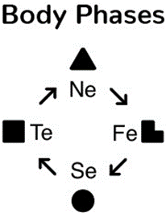  

图2 四个实体状态

Ne：潜在能量；实体的质量和内部图景，实体的结构。（内燃机活塞降至汽缸底端）

Fe：激励；潜在能量转化为动能——实体内部的微观结构的改变，包括无规律起伏。（内燃机压缩阶段，活塞上升）

Se：动能；实体内在被激活，微观结构和外在形式。（活塞上升至顶端，火花塞点火）

Te：做功；实体的动能消耗，微观结构逆向变化，坐标和熵改变，实体去激活，重回静态。（燃气推动活塞做功）

有机体总是处于四个实体状态（body phases）之一，否则它的生命就会结束。实体状态（body phases）持续存在，因此它们是有机体的稳定属性。

实体状态的任何变化都会引发“场”的状态变化，因此每个实体状态（body phase）都对应一个特定的场状态（field phase）。一个完整的能量代谢（EM）状态（phase）由一个实体状态和一个场状态组成。我认为，场状态的基础上是基本的自然现象：引力场、引力波、和电磁场及电磁波。潜在能量对应于引力场，动能 - 电磁场，激励 - 电磁波，功 - 引力波。

实体的潜在能量 Ne - Ni 引力场

实体的内部动态 Fe - Fi 电磁波

实体的动能 Se - Si 电磁场

实体的外部动态 Te - Ti 引力波

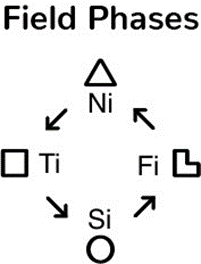  

图3 四个场状态

Ni：引力场；扭曲空间和其他实体轨迹的场、时间、时间序列中发生的事件的交互。

Ti：引力波。

Si：电磁场；排斥或吸纳实体的场、空间、空间中共时发生的事件的交互。

Fi：电磁波；其他实体发出的、交变的吸引和排斥。

### 能量代谢（EM）和信息代谢（IM）的四个阶段/状态
所有的有机体都对视野中物体发生的事件保持警觉。无论这些物体是静止（Ne）、躁动着准备行动（Fe）、行动准备完毕的紧张（Se），还是行动中（Te）。有机体内部或外部（位置）的每一个变化不仅具备能量代谢的意义，也是对其他有机体的信息信号。EM同时也是IM。EM的四个阶段与IM的四个阶段相对应。两者相互依存，不可分离。

如果一个人无法收到关于内部和外部条件是否有利于EM持续的信息，即失去反馈，是相当危险的：本来是适应环境的努力，结果却可能会被环境排斥。因此，积极的有机体会从外界（其他有机体，以及无生命的环境）获取能量和信息反馈信号。

### 实体状态
从上述情况看，人的每一个行动都包括四个能量代谢状态（阶段）。值得注意的是，其中两个是静态的，两个是动态的。

  

每一个实体状态都由心理和信息代谢机制反映出来。因此，信息代谢机制有四个元素，反映了发生在实体上的事件。

由于信息代谢（IM）只是能量代谢（EM）的反映，不区分EM和IM的四个实体状态使用的符号。

（中文译者注：原文指的是四个图形符号，但是译文中使用的是四个两字母符号。）

IM的四个信息元素（“半阶段”，half-phase）感知关于身体自身EM的四个不同侧面、不同EM阶段的信息。毕竟，从心理的角度来看，自己的身体也是一个外部实体（客体）。同样，我们需要强调，现在我们只对个人通过第一信号系统收到的IM信号感兴趣。这些信号通过有机体的感觉系统到达心理，作为具体的感觉存在。

### 场状态
人的每一个行动也可以在“场”的意义上分为四个阶段/状态。其中，两个是静态的，两个是动态的。

  

每一个场状态也被意识和IM机制所反映。为此，IM有四个元素，感知关于场的EM的四个不同侧面或状态的信息。我们将为EM和IM的场状态相分配相同的符号。

### 同质的元素
物质世界由物质实体和场组成。它们是客观的物质世界的组成部分。在人类的心理上，物质和场的感知和反映都存在四个阶段。从这个认知分类诞生之日起（荣格的作品），我们就知道，实体状态和场状态形成同质的四对，这就是为什么我们（Aushra）的符号也是成对的\*。我们可以证明IME成对出现。例如，Fi可以被称为Fe的动量，Ti也可以被称为Te的动量。 这是因为Fe和Te是动态的、过程的，而Fi和Ti是静态的。

（\*中文译者注：Aushra使用形状相同的符号表示一组内外倾IME，实心为外倾/“实体状态”，空心为内倾/“场状态”。）

每个实体状态（实体/对象IME）都有一个与之同质的场状态（场/关系IME），它们是同一现实的不同侧面，或者说是不同的反映。

### 两种顺序
上述EM/IM中，实体状态的顺序似乎是唯一合乎逻辑的：势能、势能的激励、势能向动能的转化，动能做功。也就是说，似乎人类的兴趣和认知活动只能按照这个顺序进行：首先，研究客体的潜在属性，确定是否需要与这个客体互动。如果需要，主体进入激励状态，并调动能量，以便占有或拒斥该客体。

但是，相反的顺序也是可能的：

Te→Se→Fe→Ne

在这种情况下，行动的开始是与某个客体的互动，最终逆向进行至研究其内部属性、确定是否需要该客体为止。这两种行动和思考的顺序，对应不同的IM类型。

## 3、IM区块
### 区块的形成

如上所示，每个有机体有八个稳定的属性：四个实体状态和四个场状态。它们共同构成了EM的四个阶段/状态，同样也构成了IM的四个阶段/状态。对于每个EM阶段，我们在IM机制的模型中以一个单独的阶段/状态块来反映，我们将此模型称之为模型A（Model A）。换句话说，人类的IM机制由组成区块的八个IM元素（IM Elements，IME）组成。每个区块对应于一个身体状态和一个场状态（即一个实体IME和一个关系IME）。

为了理解IME分块的规则，试着回忆一下我们将IME分为静态和动态两类：

静态IME

Ne Se Ti Fi

动态IME

Te Fe Ni Si

一个区块中的两个IME，要么都是静态元素，要么都是动态元素。例如，Se可以与Ti或Fi组成区块：考量实体的角度，可以是它的客观属性和其他实体的客观属性之间的关系的角度（【Se Ti】或【Ti Se】），也可以是从一个实体对另一个实体的需要的角度（【Se Fi】或【Fi Se】）。Te可以与Si或Ni形成区块：考量过程/进程（process）的角度，可以是它与空间中发生的其他过程的关系的角度（【Te Si】或【Si Te】），也可以是它与时间上先前或后续过程的关系的角度（【Te Ni】或【Ni Te】）。

下方的图表展示了IM区块中所有可能的IME组合。IME间的箭头是双向的，因为在一个区块中，IME可以以两种次序排列（区块内IME是有序的——不同对应不同含义的区块）。四个静态IME组成八种静态区块，四个动态IME组成八种动态区块。

一些区块以实体状态（实体IME）开始，以场状态（关系IME）结束。在这些区块中，输入信息是关于实体的状态信息，即“外倾”信息（实体信息）；输出信息是关于该实体与其他实体的关系的信息，即“内倾”信息（关系信息）。也就是说，存在于物体内部的东西被转化为存在于物体外部的东西，我们可以说信息变得“外倾”了，正如荣格所说。我们将称这样的区块称为外倾区块。

另一些区块以场状态（关系IME）开始，以实体状态（实体IME）结束。在这些区块中，输入信息是关于实体之间的关系的信息（关系信息），输出信息是关于实体内部或实体所发生的事件的信息（实体信息），也就是说，信息变得“内倾”了。我们将称这样的区块块为内倾区块。

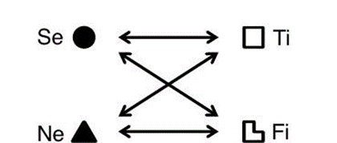  
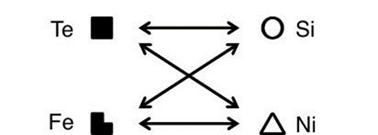  

按照上述规则，八个IME总共可以形成十六种区块；按照静态/动态、外倾/内倾区分，一共有四组：

外倾｜静态
【Se Ti】【Se Fi】【Ne Ti】【Ne Fi】

内倾｜静态
【Ti Se】【Ti Ne】【Fi Se】【Fi Ne】

外倾｜动态
【Te Si】【Te Ni】【Fe Si】【Fe Ni】

内倾｜动态
【Si Te】【Si Fe】【Ni Te】【Ni Fe】

在外倾区块里，实体的属性和状态是与其他实体的关系重产生的根本原因。例如对于区块【Se Ti】而言，客体自身的属性：力量、美感、意志力是产生对客体的积极或消极态度的原因。例如，尊重或蔑视：一个人想改变他人对自己的态度的话，必须先改变自己的属性。对于内倾的【Ti Se】来说，情况正好相反。主体对客体的态度：尊重或恐惧，决定了如何看待这个客体，进而引发客体（包括作为客体的自身）的变化。如果这个区块（【Ti Se】）在一个人的IM机制中处于主导地位（自我区块，即三字母命名法的LSI），那么这个人被扮演的角色所定义：角色是一种（客观的、静态的）关系，而这种关系决定了作为客体的自己的属性。 例如，当这个人是一名普通教师时，ta是安静的、谦虚的、勤奋的人。如果ta被任命为校长，就会变成一个独裁者。

### 输入元素（accepting element）和输出元素（producing element）

一个区块中的两个元素履行不同的功能。第一个元素对现实进行反映、成像和再现，为心理提供客观信息。这种信息来自自身内心之外的客观世界。输入的信息量可能不够，但信息本身并不是主观的，而一定是对客观世界，以及作为客观世界一部分的、“客体的”自己的反映。我们应该注意到，区块的第一元素总是带有一种“共情”感，或者说，这个元素上的信息与它所反映的事物有某种一体性。我们将区块的第一个元素称为输入元素，即对存在于外部的事物的感知。

区块的第二个元素是输出元素。它的产物来自人对第一个元素收到的信息进行提取、处理后的信息。第二个元素也可以被称为“创造的”元素，因为在它从第一个元素提供的信息中提取、处理的过程中，加入了不属于客观世界的部分。这些“部分”是这个元素自己的结论，是它对客观世界相应方面的“想法”——元素“认为”相应的现实方面是什么、可以是什么、必须是什么。第二元素是工具性的，而不是同情性的。这种工具性有两个方面：第二元素是人适应客观现实的主观方式，也是一种创造性的来源。决定这种创造性的，一是通过第一个元素收集到的完全客观的信息（的信息量），二是第二个元素的“技能”——运用是否熟练，三是对偶和施益方是否存在。不过，其他的特定因素也会导致一个人做出一个决定而不是另一个，这也会在“创造性”中得到体现。

毫无疑问，输出元素也会将现实的相应方面纳入考量，也就是说，它们不仅仅是主观的生产，也在一定程度上反映现实。然而，输入元素相对应的现实方面才是一个人真正的“支点”。同样，人们并不会把周围的输出元素对应方面与自己的相同方面联系起来，因此输出元素缺乏输入元素所具有的“移情”感。

输入元素倾向于模仿他人——模仿那些更聪明或更有经验的人，这是人间接在客观现实中定向的方式。输出元素倾向于不断进行调整：当原来的结论或决定无法实施时，人就会在输出元素的方面调整自己的认知和行动。

我们可以注意到，当一个人“代表”某个区块的输入元素发言时，会注重缺陷，谈论“缺了什么”——“世界的完整画面”中缺乏的东西。正因为如此，人关于输入元素的言论倾向于批判和否定。与之相对的是，当一个人“代表”输出元素发言时，会注重已经存在的东西，是正向的、存在的、完整的，所以被别人认为是赞美和接纳。因此，当人在输入元素有关的成就方面受到批评时，倾向于以积极的眼光看待这种批评。然而，当批评与输出元素的成就有关时，就会觉得很烦人，并认为对方企图破坏自己的心情。

### 理性元素与非理性元素

我们遵循荣格的传统，将八个IME分为理性和非理性两组：

理性IME

Te Fe Ti Fi

非理性IME

Ne Se Ni Si

相应地，根据输入元素的理性非理性属性，我们可以对IM区块进行相应的二分。我们称输入元素是理性IME的区块为理性区块：

理性｜内倾｜静态

【Ti Se】【Ti Ne】【Fi Se】【Fi Ne】

理性｜外倾｜动态

【Te Si】【Te Ni】【Fe Si】【Fe Ni】

相应地，输入元素是非理性IME的区块，可以称为非理性区块：

非理性｜外倾｜静态

【Se Ti】【Se Fi】【Ne Ti】【Ne Fi】

非理性｜内倾｜动态

【Si Te】【Ni Te】【Si Fe】【Ni Fe】

区块的理性-非理性二分是有意义的，因为TIM也以同样的方式划分。理性类型（schizothymes）的IM机制由理性区块构建，而非理性类型（cyclothymes）的IM机制由非理性区块构建。正因为如此，理性型和非理性型眼中的世界，以及其行为，都大有不同。

### 区块组（Blocking）

每个IM的模型A都由四个区块组成。我们将四个区块划为一组，称为一个**区块组**。区块组一共有四个：两个理性、两个非理性。

非理性区块组

贵族｜非理性

【Se Ti】【Ne Fi】【Si Te】【Ni Fe】

开明｜非理性

【Se Fi】【Ne Ti】【Si Fe】【Ni Te】

理性区块组

贵族｜理性

【Te Si】【Fe Ni】【Ti Se】【Fi Ne】

开明｜理性

【Te Ni】【Fe Si】【Ti Ne】【Fi Se】

每一个区块组都可以构建出四种IM模型，也就是说，一个区块组的区块可以按不同顺序组合，形成四种人格类型。每个区块组的四种类型包括两个相反的对偶对，形成社会环中的一轴。

由于区块的顺序不同，同一区块组形成的四个TIM的人，在性格上看不出有什么相似之处。更多的时候，他们看起来性格相反而不是相似。然而，如果所有输入元素和输出元素都相同，这些人就一定有一些共同点。我们可以认为这种共同点是“对世界的感知”。这种共同性，即某种“相称性”，使对偶关系和消失关系成为可能。

那么，这种“对世界的相同感知”和“相称性”是什么呢？

要了解来自同一区块组的类型有什么共同点，是什么把它们聚集起来，我们需要明白区块组之间的不同之处。首先，我们将理性区块组和非理性区块组分开，所有非理性类型的模型都由两个非理性区块组形成，而两个理性区块组则形成了所有理性类型。也就是说，我们将着重关注理性-非理性、理性型-非理性型的二分。

观察理性型和非理性型的诸区块中的元素，我们就可以发现，理性型的输入要素是非理性型的输出要素，反之亦然。

### “贵族”和“开明”

（注：在章鱼的译文中，这两者被称为“贤治”和“民治”）

在一些类型中，“时间”Ni与“情感”Fe组成区块，而“幸福”Si则与“劳动、行动”Te组成区块*。前者产生了情感的前后一致性，后者则产生了从工作中寻求乐趣的倾向。工作本身使人愉快、工作结果提供审美愉悦是很重要的。我们将这些类型称为“贵族”类型。

而在另一些类型中，由于Si与Fe成块、Ni与Te成块，这些类型的“情感”并不在“时间”上具备一致性，而是取决于其当时的“状态”；但是，这些类型会在有“未来前景”、提供未来的安全保障的行为上，倾注大量的毅力和精力。我们将这些类型称为“开明”类型。

理性“贵族”类型和理性“开明”类型的输出元素不同。非理性“贵族”类型和非理性“开明”类型的输出元素也不同。

### 非理性型眼中的世界

非理性型的输入元素是非理性元素：

Si Ni Se Ne

因此，非理性型的情感和行动总是其他因素和事物的结果——例如，恐惧，或者某种主观感受*；换句话说，状态和感受决定行动：

Si->Te｜Si->Fe｜Ni->Te｜Ni->Fe

（*英语译者&中文译者注：Aushra的原文使用了“самочувствие”，英文译者翻译为“状态”state，俄汉词典翻译为“自我感觉”，但是中文译者决定翻译为“主观感受/感受/自我感觉”。）

对于非理性型而言，客体和主体得到某种评估，或者引发某种情感，是因为它们的外部或内部属性。实体的属性是主要的，自身对实体的态度是次要的：

Se->Ti｜Se->Fi｜Ne->Ti｜Ne->Fi

### 理性型眼中的世界

理性型的认知与非理性型正相反，因为其输入元素是理性元素：

Te Fe Ti Fi

对于这些类型而言，实体外部和内部的进程（例如人们的行动和情感）导致了主观感受、危险感和安全感的形成；外部活动决定状态和感受，而不是相反：

Te->Si｜Te->Ni｜Fe->Si｜Fe->Ni

理性型人和客体间的感受和关系导致了客体的某些品质*。个人对客体的感觉和态度决定了客体的属性：

Ti->Se｜Ti->Ne｜Fi->Se｜Fi->Ne

（*英语译者注：Aushra的意思很可能是，理性型基于自身对客体的感觉和关系，形成对客体外部和内部属性的认知。）

### 非理性区块组

对于贵族非理性类型（SLE、IEI、SLI、IEE）而言，他人的意志力是这个人唤起的逻辑感受，以及对这个人的评价的产生原因；他人潜在的精神品质是产生伦理感和态度的原因：

Se->Ti｜Ne->Fi

自身感受和状态的好差是身体活动的原因，而审美感受和喜悦的缺乏会导致陷入被动。任何危险、任何未来可能的麻烦都会在产生紧张，这种紧张要么通过情绪得到释放，要么得到动员、采取行动：

Si->Te｜Ni->Fe

对于开明非理性类型（ILE、SEI、ILI、SEE）而言，情况正好相反，因为他们对相同输入元素的感知链接了不同的输出元素。某人的意志和身体素质是道德上的感受和态度的产生原因，而他们潜在的精神品质引起逻辑上的感受和态度：

Se->Fi｜Ne->Ti

审美感受，例如由外在感觉引发的主观感受，是引起内部兴奋和情感的原因。愉快的感觉带来高兴、不愉快的感觉引起愤怒。如果没有感觉，内部兴奋和情绪表现就不会产生，能量的调动也无法进行。对未来的担忧会引发身体行动，也就是说，当开明非理性型看到活动会给他们带来什么、摆脱什么时，会变得极为认真：

Si->Fe｜Ni->Te

### 理性区块组

接下了的任务是阐释贵族理性型和贵族非理性型的区别，而这种区别依旧来源于输出元素。

对于贵族理性类型（中文译者注：EIE、LSI、EII、LSE）而言，具体的行动是引发某种状态和审美感受的原因，个人的主观感受是行动或客观过程的结果。因此，为了给自己提供适当的感觉，贵族理性类型需要搞明白，哪些活动是合适的。同时，情感波动会引起危险或安全的感觉。这意味着，只有适当的情感才能为这些人提供安全感，无论情感来自自身还是他人：

Te->Si｜Fe->Ni

逻辑感受决定了对客体的评价和它们“变成”什么。对物体的态度是主要的，其外在品质是次要的。反过来，伦理感受决定了贵族理性类型如何看待精神品质。在这些人眼中，关系亲近的人和道德感受更高的人，具有更高的精神价值和更好的精神品质。

Ti->Se｜Fi->Ne

对于开明理性类型来说，工作活动和行为并不产生审美感受，而是产生对未来的安全感。情感和内在的能量兴奋，产生审美感受和审美愉悦：

Te->Ni｜Fe->Si

相应地，客体和主体的精神品质由逻辑关系决定，他人的能力是根据个人如何理解客观世界的相互关系的逻辑来衡量的，也就是他们的“逻辑感受”的质量。这可能是为什么【Ti Ne】处于主导位置的人会被吸引到对世界的哲学理解上。对于这类人而言，人们的意志和外在品质被伦理感受和人际关系决定。这意味着，一个与他人的关系稳定而理智的人是一个坚强的人，而不是一个意志薄弱的窝囊废。

Ti->Ne｜Fi->Se

### 反映的客观性的不同程度

正如实体之间的关系由其属性决定一样，实体的属性也由实体之间关系决定。知道了实体，就可以投射关系；知道了关系，就可以投射实体的形象。世界的这两个组成部分相互依存、不可分割：场由实体决定，实体由场决定，两者程度相同。

每个区块只反映现实的一个方面。外倾的区块反映实体的属性，并投射（产生）对这些实体的关系、态度和感觉*。内倾的区块反映实体之间的关系，即连接这些实体的场（或一种感受）的属性，并产生对实体本身的属性的认知。

（*英文译者注：对于外倾区块，输入元素是外倾的，输出元素是内倾的。内倾区块的情况则相反。）

IM的每个区块只如实反映客观世界两个方面中的一个，并对另一个部分进行某种推算。如果输入元素得到了关于世界上所有实体或关系的所有信息，这种“推算”就会完全对应客观现实。然而，这是不可能的。

因此，即使一个外倾者充分了解了时下的物理学定律，在内心深处也相信物质世界的起源和起点是一个实体。一个内倾者则把这个起源设想为一个场。

我们依旧以区块【Se Ti】和【Ti Se】为例。【Se Ti】“看到”的实体就是它客观的样子。然而，这个区块将实体间的关系理解为“眼前所见即是一切实体，而实体间的关系则是‘只有这些实体’的情况下‘应该’达到的关系”。对这个区块来说，关系只不过是涉及的实体的属性的衍生物。也就是说，这些关系被设想为什么，并不是世界本身的反映（实然），而是一种观点（应然）、一种投射。这个人认知实体之间的关系的方式，以及对物体的感受，其意识到的实体的性质决定的。关于关系的结论，只有当建立在客观的输入信息时，才是客观的。这些结论当然是主观的，因为个人可以拥有的信息量是有限的。这个结论的准确性取决于此人对现实的这个方面的认知和知识水平。随着这个区块的知识和认识水平的提高，结论的客观性也随之提高。但由于一个主体不可能意识到每一个客体的每一个属性，所以，客体间关系在主体中的再映（representation，上文有所涉及）并不是充分的、具体的、完全客观的。在事实的、客观的实体关系（实然）和个人对关系的结论（应然）之间，不可避免地会出现某种裂缝。

【Ti Se】则展现了这样的图景：它反映实体间的关系。这个区块完整而准确地得到了关于已知的实体之间的每一个关系的信息。因此，它对真实实体的再映并不尽然客观，尽管这些实体并不比它们之间的关系更“有形”。该块反映了一种实在的关系——连接实体的场的属性之一。物体本身被这个区块以一种有点理想化的方式投射进内心，再投射向外部世界。正因为如此，这个块所产生的、关于实在实体的信息，总是与实际存在的实体不同。

输出元素的产物兼具客观性和主观性。客观性来源于它对客观信息的依赖，主观性则来自这种信息受到的主观现实、主观可能性（应然）的限制。

### 对立和矛盾是进步的动力

每个人的IM机制因其输入元素-输出元素，都只反映了现实的一半方面（八个IME中的四个）。由于这个原因，客观世界在人的心理中的反映并不完全客观，那些未被客观反映的部分是想出来的，猜出来的。我们还需要注意：在四个输入元素中，只有两个有意识，有“思想”，能够证明和显示他们的知识来自哪里。另外两个人的知识处于我们通常所说的经验或技能的水平。这进一步降低了我们对一个人的“客观性”的评分。

同时，这也正是人能够创造出客观上不存在的事物的原因。由于IM机制的主观性，它并不能完全客观地反映全部方面，因此，人能够改变客观世界，把自己的、新的事物带到世界上。

客观事物和人的心理对客观事物的主观反映之间的矛盾是进步的动力，是人类智慧的创造力（以及错误）的起源。这种矛盾是人的思想能够脱离客观世界的原因。如果思想无法挣脱客观性，人类的创造力就不会存在。

### IM与EM的管理作用

每一个IM区块都管理着有机体的IM、EM，以及信息-能量代谢的外部表现。这种管理过程至少包含以下三个方面：

-	对有机体系统运作的管理，这使得有机体的能量自行运转成为可能。
-	对行动的管理，这使得人类的社会化成为可能。这种管理的主要目的是为自己提供生活必需的事物。
-	对信息的收集和使用的管理。这包括IM区块在某人与不同TIM的人相处时，对对方行为的“调控”。

## 4、IM机制和模型A

### IM的模型A的形成

IM区块形成了IM环。不过，退一步说，我们也可以说IM环是由IME形成的。此外，两个IM环中的一个（静态环）由静态IME形成，另一个（动态环）由动态IME形成。静态环反映世界的静态现象。同样地，动态环反映世界的动态现象。这些环反映了现实的两个共存的侧面。当下对大脑不对称性的研究，包括罗杰·斯佩里（Roger Sperry）的研究，表明这两个环位于不同的大脑半球中。归纳思维是静态环所固有的能力，而演绎思维是动态环的能力。在人的精神中，两个环中的一个更活跃、更有意识；另一环则更被动、更无意识。

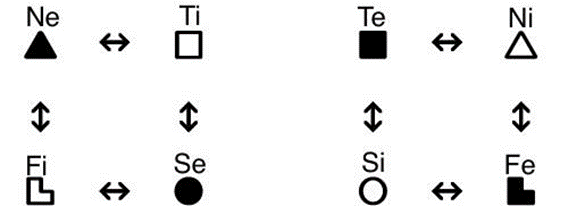  

图4 IM的模型A的通用图

左：静态环（归纳环）｜右：动态环（演绎环）

在IM环中，IME被能量脉冲连接。能量脉冲有两个可能的方向：“+”和“-”。信息在IME间的传递有两个可能的方向。因此，图4中，连接IME的箭头是双向的。

“能量脉冲”在一般语境下，指的是接收信息导致的心理变化。我们可以采取一种能量本位的视角，将接收信息的过程视为一种能量的激发。

在图5中，我们将图4中的模型按照正负号拆为两个模型。在模型1中，静态环中的信息方向被赋予“+”号，而动态环中的信息方向则被赋予“-”号。在模型2中，情况正好相反：静态环的信息方向被赋予“-”号，而动态环则是“+”号。IM机制中，两个环在形式上以类似“感应”的方式连接。

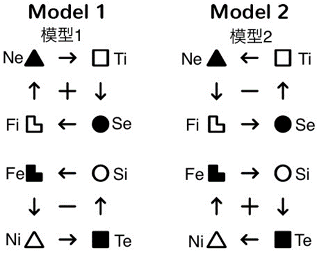  

图5 拆分正负号的两个模型

请注意，同一个模型中，两个环的同质元素的位置是镜像的：沿着中轴，Fi与Fe镜像，Ni与Ne镜像，等等。这个模型是“反-对称”的。

模型1和模型2都是通用化的，每个模型可以展开为八个TIM。我们将以模型1为例展开这一过程。

我们已经知道，IME组成区块，每个IME要么是输入元素，要么是输出元素。此外，在非理性型的所有区块中，输入元素总是非理性IME；而在理性型的区块中，输入元素总是理性IME。在此基础上，我们可以从模型1展开出两个模型：非理性型的模型1-1（Model 1-1）、理性型的模型1-2（Model 1-2）。由于输入元素是对外界的感知，我们将以由外部指向内部的箭头标记输入元素。

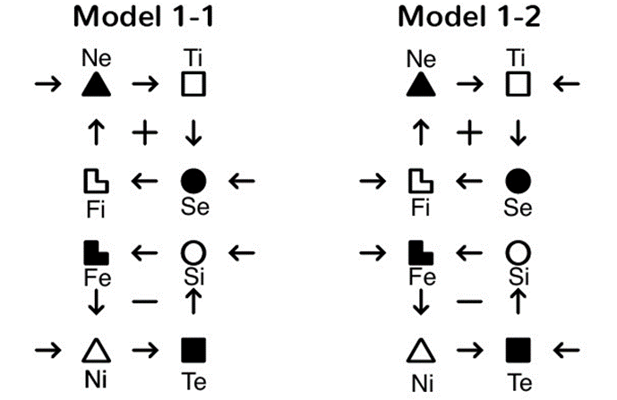  

图6 模型1的非理性型（左）和理性型（右）拆分

一个人的理性/非理性属性是内生的。根据我们的数据，非理性型的右脑负责静态部分，左脑负责动态部分。对于理性型，情况正好相反。

值得注意的是，同一个模型的两个环的输入元素是同质的（例如模型1-1的Ne与Ni、Se与Si）。因此，如果一个环由外倾区块构成，另一个环一定由内倾区块构成。

在每个环的两个区块中，一个区块更加“彰显”，另一个则更加“暗示”。“外显的”两个区块由成对的IME组成：一个区块位于模型的顶部（第一行），另一个位于模型的底部（第四行）。“内隐的”区块与之类似，但被夹在外显的区块之间（第二行和第三行）。这样，通过安排行列、调整顺序，模型1-1可以被继续拆分：

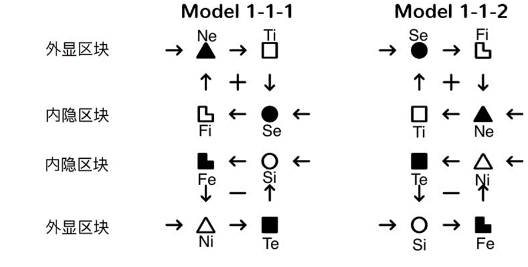  

图7 模型1-1的拆分（按照区块的外显/内隐不同）

本节开头提到，在TIM的模型A中，一个环是主动的、有意识的，另一个是被动的、无意识的。基于这一区别，我们可以从模型1-1-1里再次拆分出两个模型：这一次拆分得到了两个具体TIM的模型A。其中一个TIM的静态环是主动的，另一个TIM的动态环是主动的。为了方便起见，我们把被动环放在下方，主动环则放在上方。

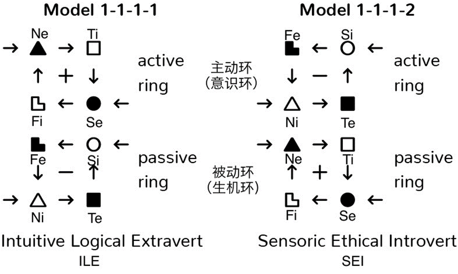  

图8 模型1-1-1的拆分，ILE和SEI的模型A

这两个TIM的模型A属于互补的、对偶类型的两类人。其中一个是外倾类型，另一个是内倾类型。按照这样的拆分，我们可以从图4所示的通用模型A中得出16种具体类型。

根据我们的猜想，外倾者的IM的主动环位于右脑；内倾者的IM的主动环则位于左脑。这经常表现为人的面部的不对称。

模型A由四个IM区块按照严格的规则形成。IM区块块有十六种，每一种IM区块都充当（且仅充当）一个IM模型的“主导”区块。同样，它也是且仅是一个IM模型中的第二个——同理，第三个，第四个。因此，16个IM区块形成（且仅形成）16个模型A。这意味着，只要知道一个TIM的区块中的一个，且知道这个区块在模型中的位置或执行的功能，就足以重建这个TIM的整个模型。

一个模型的前两个区块（主动环）的静态-动态、内倾-外倾的二分属性相同；后两个区块（被动环）也是如此，但其上述二分属性与前两个区块相反。同一个模型的四个区块的理性-非理性二分属性必然相同。因此，为了标记TIMs，我们将使用第一区块的IM的符号*。图8显示了两种TIM的完整模型A：【Ne Ti｜ILE】和【Si Fe｜SEI】 。这种标注类型的方式考虑到了主导环的符号**。

（*中文译者注：Aushra的原文使用的是图形符号，但是译者使用二字母命名和方括号，并标注这个类型的三字母命名以区分类型和区块。

（**读者明白IME、区块和类型的动静态、理性-非理性等区分就可以了。）

### 环的交互

输入元素输入的信息将使IM环被“充能”。理想情况下，所有环以同样的强度充能，此时IM和EM之间没有产生摩擦，因为有机体的EM的所有环节都以同样的强度得到“暖机”。但这只是理想情况：一个人的被动环受到外界“充能”的强度不低于自己向主动环“充能”的强度。请读者牢记这个想法，我们将在下文中多次提到这个概念。

在模型A中，一个环带有“+”号，另一个带有“-”号。它们是否相互感应能量？我们只知道如下的事实：如果被动环先于主动环接受信息，被动环首先被“充能”，那么这个人就会感觉到一股力量和能量，并且很容易找到主动环需要的信息。这样，这人就会既足够活跃又足够冷静，通常被其他人当作正面榜样。

当被动环没有收到所需的输入时，情况会比较糟糕。主动环收到的信息需要具现，并触发了被动环的活动。此时，这个人会感到不安。对于外倾类型，这种不安使他们不顾实际情况而盲目行动。对内倾类型而言，这种不安则使他们“动弹不得”，什么都没法做，也失去了与环境的接触。人们之所以没有注意到自己的这种情况，是因为他们没有看到、也不了解其背后的原理。

### 对偶TIM的模型A的交互

对偶类型的IM模型，在一定程度上可以称为“相反的”模型，因为其中一方的主动环的IME，在另一方的被动环中。

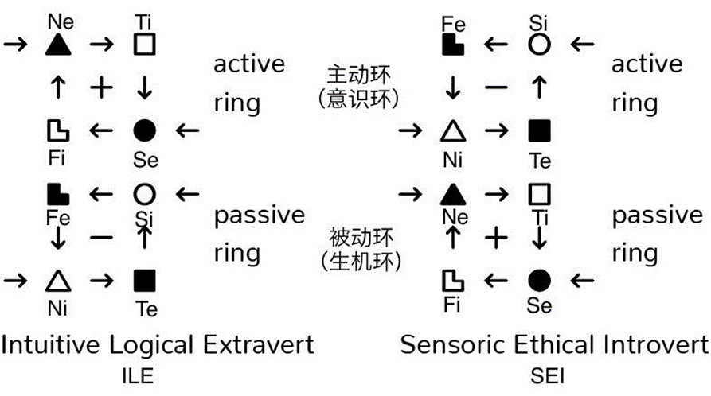  

图9* 【Ne Ti｜ILE】和【Si Fe｜SEI】的模型A

（*这里原文是一张去除了不必要文字的图8，但是译者认为图8可以替代图9。所以，这里放的其实是裁剪的图8，敬请谅解。）

图9所示的【Ne Ti｜ILE】和【Si Fe｜SEI】的模型A符合研究观察。在对偶中，双方主动环为对方的被动环提供有意识的信息。这导致了两个人的最优社会实现，增加了他们的活力。从外部看，双方似乎并不在互相“激活”，而是互相调整他们的活动“线”。这种“同步”显著地平衡了外倾者的能量，并提高了内倾者活动的开放性。第一个人（ILE）静态的主动环向第二个人（SEI）静态的被动环提供信息，这些信息有助于第二个人（SEI）在实体世界中定向。第二个人（SEI）动态的主动环向第一个人（ILE）被动的动态环提供信息，这有助于第一个人（ILE）在感受和行为、情绪间建立合理的联系。

在没有对偶的情况下，图9所示的外倾者（ILE）的行为将缺乏思考、混乱不堪，失去了充能所需的积极情绪。这导致了活动失衡和情绪剧烈波动；当他们（ILE）不知道该做什么、该用什么来占据自己的行为时，就会“停机”。因此，尽管乍一看，未对偶化的外倾者（ILE）更活跃，但实际上并非如此。他们只是不太平衡。但是，和其他静态类型一样，他们（ILE）最常缺乏的是身体活动和内部“情感”活动。他们也不擅长对自己的健康状况做出评估。他们从来都不真正明白，破坏自己的好状态、影响健康的因素是什么。正因为如此，对于ILE而言，任何生理疾病（尤其是消化系统疾病）都会导致无法治愈的慢性病。

在没有对偶的情况下，图9所示的内倾者（SEI）无法确定自己的身心潜能。他们无法将自己与其他人进行合理的比较，因而确信凡是他们自己能够做到的事，其他人也能做到。他们也不知道如何评价其他人，所以他们经常漫无目的地喧闹，随意建立联系。这里并不是说，未对偶化的动态类型缺乏身体活动——他们并不缺乏——但这种活动相当挑剔，对达到目标并无帮助。这造成了持续的紧张，在没有对偶的情况下，无法自行缓解，会导致慢性病——特别是心脏病和肾脏疾病。

### 激活TIM的模型A的交互

每种TIM都与另一种TIM互为“激活”关系，如图10所示：

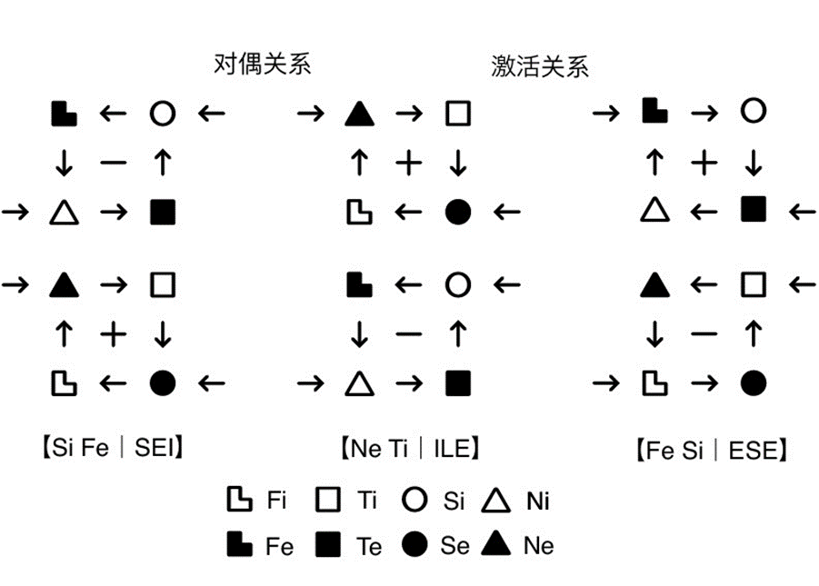  

图10 对偶关系和激活关系  
（以SEI-ILE-ESE为例）

如果我们比较某个TIM（例如ILE）的激活者（ESE）IM模型和其对偶（SEI）的IM模型，我们会发现，ILE、ESE和SEI共享两个相同的IM环，但是同一个环中能量脉冲方向不同。ILE及其对偶SEI的动态环符号是“-”号，而ILE的激活者ESE的动态环符号是“+”号。

这种差异带来了什么？真正的能量“激活”。目前的观察证实了这一点。激活的效果，在初次互动中最为明显。在激活关系中，一方的主动环并没有为另一个方的被动环提供信息，而是在其中感应了能量。

### IM的十六种模型A

图11展示了全部十六种TIM的IM模型。这些模型按照其静态环的符号分组，因为静态环的符号决定了相应TIM在社会IM环中的位置（见第一部分“引言”中的图1）。值得注意的是，社会IM环，或者说社会进步（Social Progress，SP）环，是由社会监督环组成的，每个环都由四个TIM组成，一共有四个环。新的社会经验——对一个社会有价值的新信息——通过社会进步环（监督环）传递，并且信息单向流动。四个监督环构成了整个社会人格——社会“感应”环，或者单纯的“社会进步环”。环与环之间存在“感应”联系，这表明，社会发展也遵循一定的规律，就像物理学一样。并且，如果我们了解这些规律的表现形式，就可能有意识地调控这种发展（加速或减速发展进程）。这个问题在早期的专著“类间关系理论”中有过更充分的阐释。

在图11中，同一监督环的TIM的模型A排成一行。对偶的模型上下相邻。每一个对偶对都赋予了序列号，模型的命名则是对偶对的序列号加上字母S（Static，静态）或D（Dynamic，动态）。

静态环“+”，动态环“-”的类型
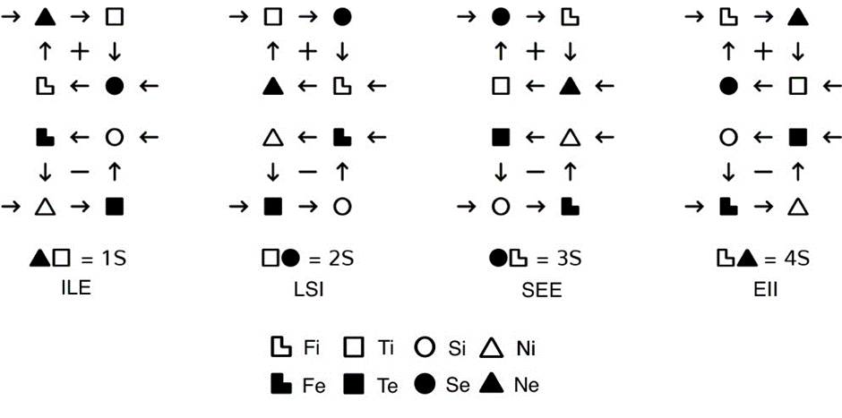  

图11-1 正向（positivist）静态类型

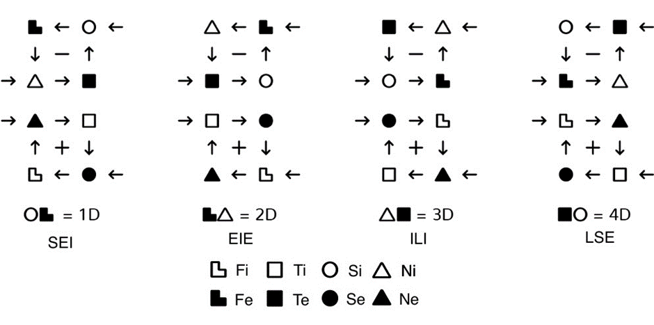 
图11-2 负向（negativist）动态类型

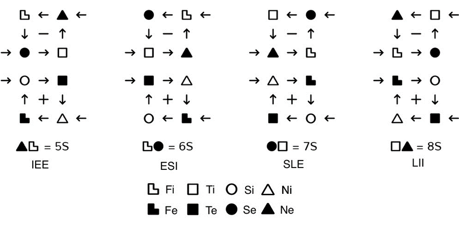 
图11-3 负向静态类型

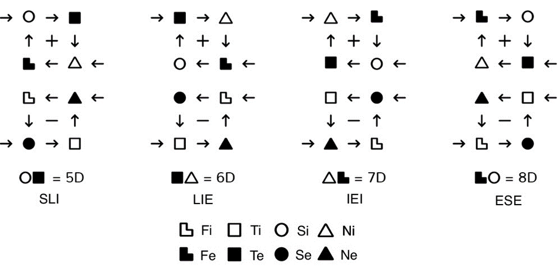 
图11-4 正向动态类型 

### 社会人格

我们将再次展现社会进步环，这次比图1中的画法更详细。图12不仅显示了不同TIM是如何结合成社会IM环的，而且还显示了具体的有益和监督关系中的每一方。

对偶IM模型彼此相邻。实心的箭头从监督方指向受制方，虚线的箭头表示社会请求（有益）关系。

图12指出，在社会IM环中，最主要的关系是监督关系。这是一种不愉快的关系，受制方会尽力与危险而傲慢的监督方保持距离。这种关系对监督者来说也是不愉快的，但在大多数情况下，这种不愉快只是由于被监督者容易被激惹。

社会人格  

社会进步环（由监督环构成）  

↙第一社会进步环  |  第二社会进步环↘

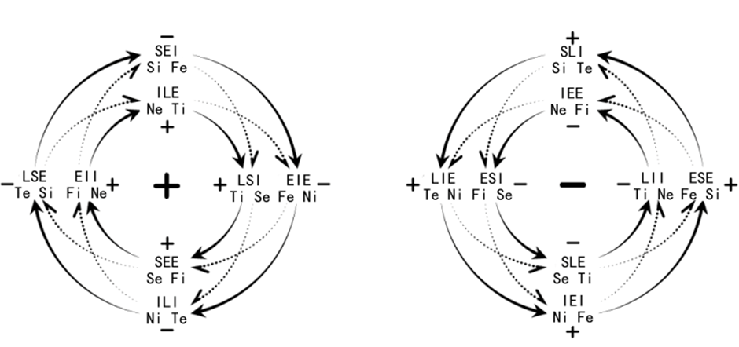 
图12 完整的社会进步环

监督关系使对偶对之间保持距离，甚至互相“逃离”。这为社会请求从请求者（施益方）转移到接收者（受益方）提供了最佳条件。当这种距离由于缺乏监督者而无法保持时，请求者（施益）和接收者（受益）的IM机制就会以某种方式相互吸引。此时，社会请求变得不可能实现；更重要的是，对偶对也变得不可能正常运作。例如，请求者（施益）吸引接收者（受益）、并灌输信息的能力，也许应该由这样的事实来解释：请求者（施益）的主动环（意识环）与接收者（受益）的对偶的主动环（意识环）非常相似，而且只 “超前”了一个阶段。

在图12中，实线箭头从监督者指向受制者，虚线箭头从请求者（施益）指向接收者（受益）。

每个社会进步环可以分解成两个监督环。这样，我们可以把每种TIM的标签减少到一个IME，从而直观地检查监督环中模型A的机制的运作。如果模型A的主动环（意识环）的正负号给定，只需要一个IME就可以表示TIM。这样，就只需要指定模型A的主动环（意识环）中脉冲的方向。

社会人格

社会进步环（由监督环构成）

↓     第一社会进步环  |  第二社会进步环     ↓

↙+IME+环 | +IME-环↘

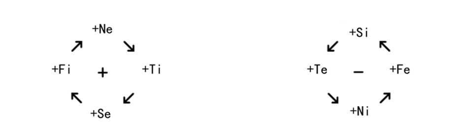 

↙-IME+环 | -IME-环↘

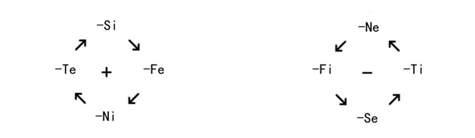 

图13

我们看到“+”和“-”的各种组合：TIM内能量脉冲的方向，以及社会IM模型的符号。这些是信息接收和转移的方向。此外，图13显示了极对（超我）关系。这些关系是在监督环中“正相对”的类型之间的关系，例如，+Ne（ILE）和+Se（SEE），+Fi（EII）和+Ti（LSI）。

### 正与负

从外部接收和传递信息信号的两个方向（“+”和“-”）在IM模型的所有部分交织在一起，令人想起东方哲学中的阴阳交织。例如：

-	在模型A中，一个环是“+”，另一个是“-”。
-	在一对对偶中，一种TIM是“+”，另一种是“-”。
-	在社会进步环中，一个社会监督环是“+”，另一个是“-”。
-	在社会人格中，一环的社会进步符号是“+”，另一环是“-”。

如果我们遵循东方传统，我们将不得不补充一个事实，即在每个IME背后都有两条经线，其中一条是“+”，另一条是“-”。

下面的数学模式相当有趣：
- IME × 2 → IM区块
- IME × 4 → IM环
- IME × 8 → IM的模型A
- IME × 16 → 一对对偶
- IME × 32 → 一个区块组，即两对对偶、两对超我形成的社会进步环一轴
- IME × 64 → 两个区块组/四对对偶/一个社会IM环
- IME × 128 → 两个社会IM环——社会人格，社会IM的“线圈”（coil）

### 提问（Asking）-陈述（Declaring）

在所有TIM中，有一半可以被归类为提问型——那些说话时倾向于用询问的语气和方式的人。另一半可以被归类为陈述型——那些不断陈述、告知他人某些事情的人。在每一对对偶中，一方是提问型，另一方是陈述型。

“正”社会环的外倾者和“负”社会环的内倾者是提问型，陈述型与之相反。我们仍不知道，如何通过TIM的模型A的结构来解释这一点。

在交流中，提问型常常让其他提问型疲惫而生气，陈述型之间也是如此。

### 简化的模型A*

到目前为止，我们使用的都是模型A的环形写法。但那样的写法相当复杂，因此，为了“日常使用”，模型A的画法可以简化。两个环可以被打破，并上下摆放，这样，在每种类型的IM的每个块中，输入元素在左列，输出元素在右列。按照这个想法，1S【Ne Ti | ILE】的模型A可以简化。

正如前述，每个IM区块都可以充当模型A中的第一、第二、第三和第四区块。同样，每个IME都可以执行第一、第二、第三、......、第八功能。为了简化问题，并避免混淆，我们将使用以下编号系统：

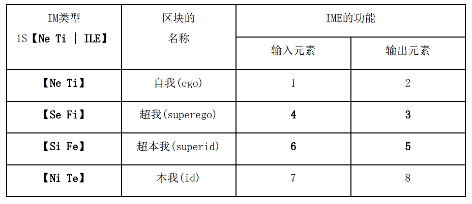 

在下表中，我们将展示全部16个类型的简化的模型A：

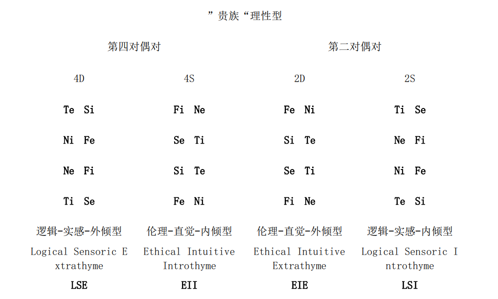 
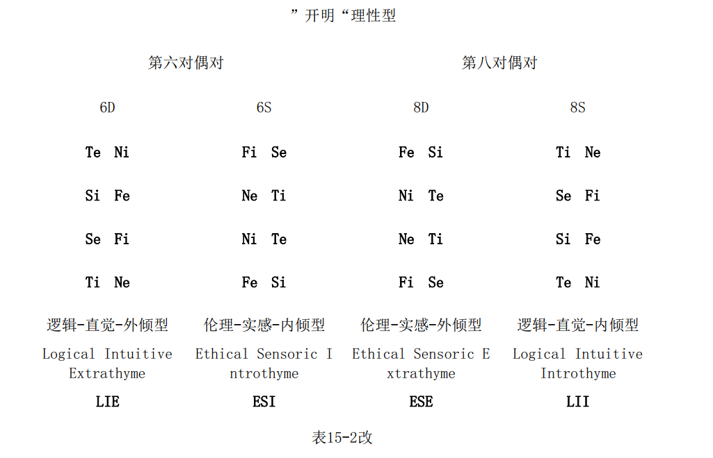
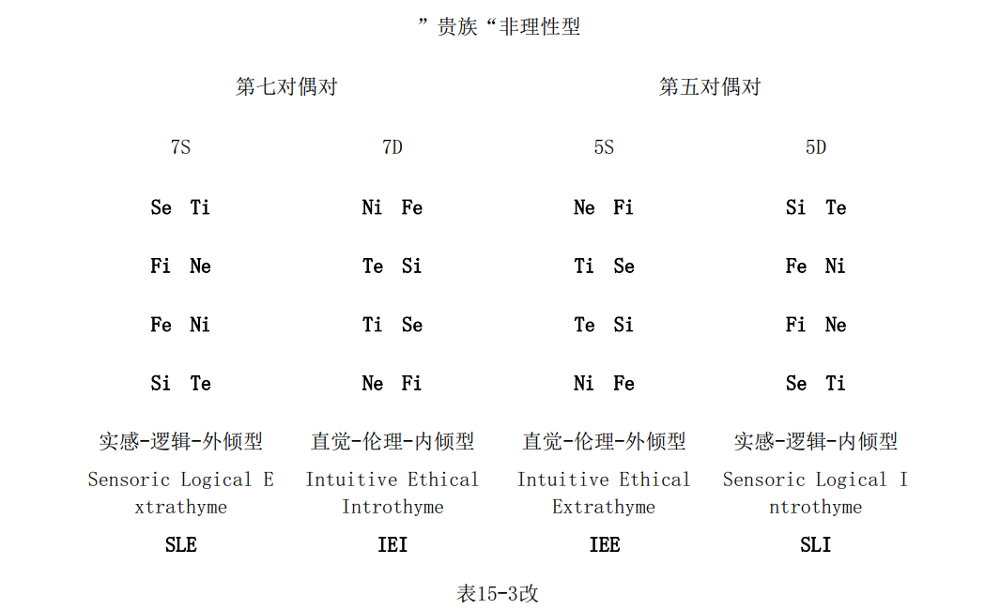
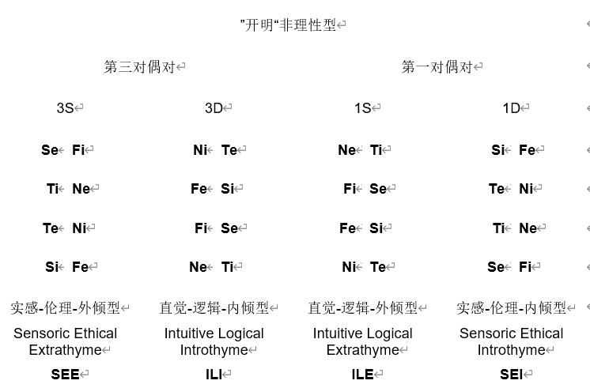

### 第一信号系统和第二信号系统

一个人通过对外部和内部刺激的反应，向外界提供有关自己的信息。所有阶段都存在于每一个身体活动的行为中：肌肉的兴奋、紧张和放松。这构成了一道丰富的信息流，关于有机体的状态和反应，以及有机体身上或内部发生的过程。正如我们所见，EM内部燃烧的两个阶段/状态对应一个IM环，另外两个阶段/状态则对应另一个环。

只有被动环（生机环）提供直接的、不被意识改变的信息，生机环的信息不会被思考，而是直接被第一信号系统处理。被动环（生机环）的信号位于无意识的层面，直接反映身体内部发生的事情。被动环（生机环）不提供完全有意识的反应，这意味着它不提供完全有意识的信息。

我们认为，“有意识”的信息，是指诸如可以无视当下的情况而被调用的信息这类的信息（例如视觉记忆）。也就是说，有意识信息是一个人可以记住的信息，这样就可以脱离对具体的实际情况的需求，向其他人进行传达，或者进行思考。只有在可以被主动转移到第二信号系统时，一种感知的事物才能被认为是有意识的。

被动环（生机环）能做的，不过是通过模仿他人来“适当”行事，以便在不引起太多注意的情况下完成关键的功能，这意味着通过记忆中的方法和技巧行事。因此，当被动环（生机环）被对偶“编程”时，话语本身并不重要，重要的是其对偶灌输信息的能力、面部表情、语调、自信的语气和这人正好需要的信号：在某些情况下，质疑的语气被需要；在其他情况下，肯定的语气则被需要。错误的语气并不可取，它会令人恼火。

主动环（意识环）对信息进行理解，将其从系统一转移到系统二，并与社会中的他人共享。输出的信息受到控制。除了罕见的心理疾病外，一个人只说ta想说的、只展示ta想展示的。（虽然，人格的不同程度的神经症，可能造成部分崩溃，这也毋庸置疑是可能的）

被动环（生机环）以“无意识”的形式储存它所收到的经验、能力和身体技能的信息。主动环（意识环）的信息存储的形式可能是与当下无关的图像，或是抽象知识——这些知识很容易在记忆中重构，从而在需要的时候转移到第二信号系统中，而无需费力。

由于主动环（意识环）有意识地察觉到它对相应EM部分的参与，而被动环则没有这种意识，正如荣格所说，前者是“一个人所做的”，后者是“一个人身上所发生的”。

### 现实的反映与“再反映”

在信息运用的方面，主动环（意识环）的目的是连接人与外界，即在感知和处理信息时对现实直接反映。此外，主动环（意识环）也向社会中的其他人提供这些信息。因此，当主动环（意识环）为自身需要反映现实时，它接收的信息将被称为一次信息（primary information）。当它在第二信号系统的帮助下“重新反映”现实时，它向社会提供的信息被称为二次信息（secondary information）。

二次信息可以分为灌输的二次信息和附属的二次信息。

### 信息的四种类型

总的来说，在社会人格内的信息交换中，存在四种信息：

-	从一人的主动环（意识环）传输至另一人的主动环（意识环）的信息，是二次附属信息，经由第一和第二信号系统处理。只有通过经验校验时，这些信息才会被使用。
-	从一人的主动环（意识环）传输至另一人的被动环（生机环）的信息，是二次灌输信息，经由第一和第二信号系统处理。这些信息作为接收者经验的替代品得到使用。
-	从一人的被动环（生机环）传输至另一人的主动环（意识环）的信息，是接收者可以觉察到的一次信息，经由第一信号系统处理。
-	从一人的被动环（生机环）传输至另一人的被动环（生机环）的信息，是接收者并不察觉到的一次信息，经由第一信号系统处理。

因此，一个人接收，或者说可以接收另一个人传来的四种信息：两种一次信息（有意识的和无意识的），以及两种二次信息（附属和灌输）。

显然，主动环（意识环）以直接和间接信息为生。其主要的信息来源，是对世界的直接反映。间接信息起附属作用，需要先通过自己的经验验证才能被使用。然而，这只适用于由对方的主动环（意识环）提供的信息；由对方的被动环（生机环）提供的信息不是间接信息，因为它是无意识地给出的，并没有针对的对象*。这样的信息作为它所反映的个人**的直接知识的来源。

（*英语译者注：间接信息是通过第二信号系统给出的信息，而被动环无法做到这一点。）

（**英语译者注：是指那个从被动环发出信息的人。）

至于被动环（生机环），它也得到了直接和间接的信息。但在对于被动环（生机环）而言，由他人的主动环提供的间接信息——二次灌输信息——对生活和机体运作尤为重要。被动环会模仿相同的主动环*。

（*英文译者注：这里指的是其对偶的主动环/意识环，两环是相同的。）

个人在社会中的作用由两个因素决定：

1.	与现实的直接联系。从现实世界中获得足够的直接信号的能力；成为别人的现实信息的来源的能力。例如，如果不通过面部表情（第一信号系统），那么通过语言（第二信号系统）和手势（第一信号系统），“引人注目的目光”（第三信号系统）或 “能量打击”（第四信号系统）。
2.	通过社会，现实世界的间接联系。从这个社会获得足够的间接信息，并成为他人的信息来源的能力。
